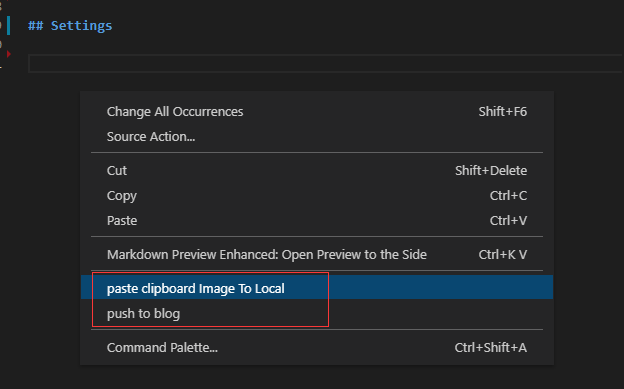

# about md-push-blog

Another way to write  notes and blogs  with vscode

why?

I'm used to write notes with vscode, but I want to post some notes to my wordpress blog.


features:
- paste clipboard Image To Local
- push markdown file to blog

## 1. paste clipboard Image To Local

write markdown isn't very friendly to handle Screen capture

With this plug-in, you can right-click to get the pictures in the clipboard

## 2. push markdown file to blog

Sometimes you want to post notes to a wordpress
You don't need to log on to the wordpress anymore



# Settings

create  `settings.json` file to your vscode workspace

```json
[
    {
        "url": "http://blog.xuphp.com/xmlrpc.php",
        "blogid":"",
        "username": "admin",
        "password": "123456",
        "isOpen":true
    }
]
```

This plugin publishes the blog through `metaWeblog`,

If you like, you can post to multiple blog platforms at the same time

read more : https://codex.wordpress.org/XML-RPC_MetaWeblog_API

> 博客园 支持 metaweblog  https://rpc.cnblogs.com/metaweblog/xuzhenjun

